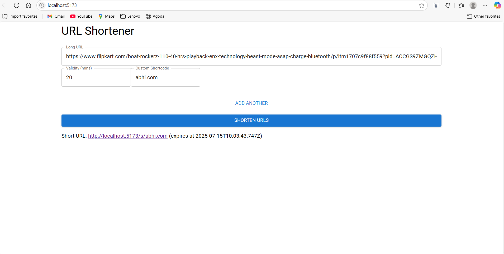

# 2218159
Afford Medical Frontend Project-# 🔗 URL Shortener Web App

A modern and responsive **URL Shortener** built with **React + Vite**. This project allows users to shorten long URLs with custom validity periods, track clicks, and analyze URL statistics. It also features a robust **logging middleware** that logs frontend activity to an external evaluation server, as required in assessment.

---

## 🔍 Output Preview

Here’s a preview of the working URL Shortener App:

## 🧠 Features

- 🔗 Shorten long URLs with optional custom shortcode
- ⏳ Set URL expiration duration (default: 30 minutes)
- 📊 View URL analytics like creation time and click stats
- 💾 LocalStorage support for data persistence
- ✅ Input validation with user-friendly alerts
- 🧩 Logging middleware integration for full lifecycle event tracking

---

